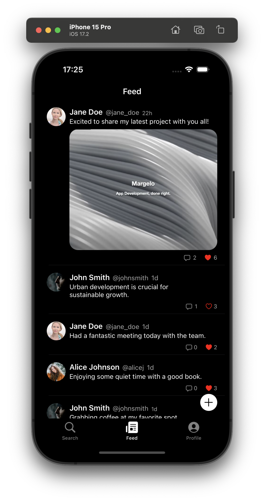
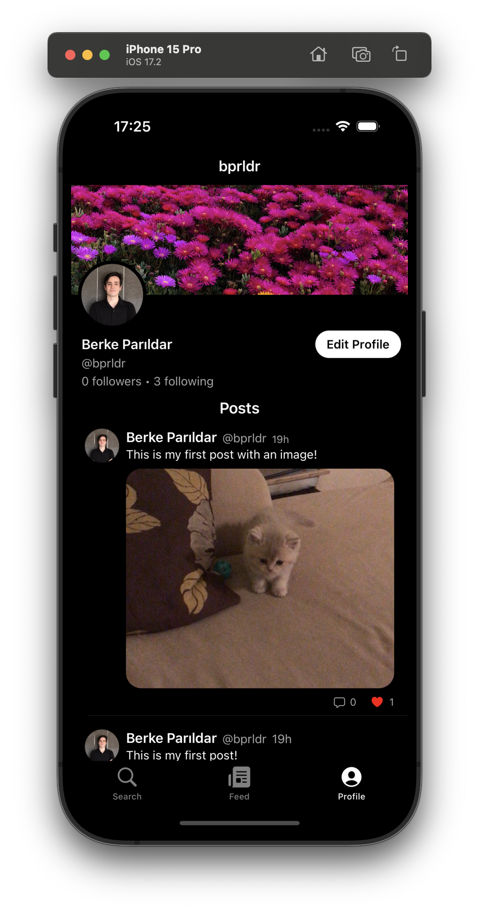
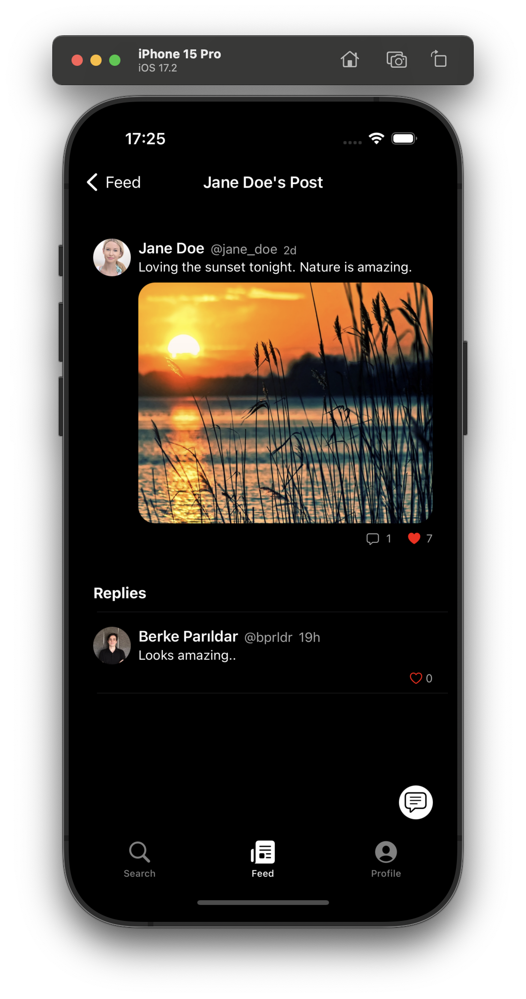

# Holler

Holler is an iOS social media application inspired by Twitter, where users can share their thoughts, updates, and moments with others. The app provides a platform for users to post text and photos, interact with other users through likes and replies, and follow their favorite people to see their posts in a personalized feed.

## Screenshots

### Features

- User Registration and Login: Users can sign up with email, password, name, and username, and log in using email and password, all handled via Firebase Authentication.
- Tabs and Navigation: The app features three tabs—Search, Feed, and Profile—allowing users to search for other users by username, view posts from followed users, and view or edit personal profile details.
- Posting and Interaction: Users can create posts with text, photos, or both, and interact with posts by liking or replying, with all interactions tracked in real-time using Firestore.
- User Profiles: Users can view other users' profiles, follow or unfollow them, and see their posts, profile image, banner image, and follower information, with all data stored in Firestore.
- Profile Customization: Users can edit and update their profile images and banner images, with images stored in Firebase Cloud Storage.
- Backend Integration: The app uses Firebase Firestore for managing user data and posts, Firebase Authentication for account creation and login, and Firebase Cloud Storage for storing images.
- Technical Stack: Developed using UIKit for the user interface, and following the MVVM (Model-View-ViewModel) architectural pattern to ensure a clean and maintainable codebase.

### How to Use

- Sign Up and Log In: Open Holler, sign up with email, password, name, and username, and log in using the registered email and password.
- Navigate the App: Use the Search Tab to find and follow other users by typing their username, check the Feed Tab to see posts from followed users, and access the Profile Tab to view and edit personal profile information.
- Create and Interact with Posts: Tap the create post button on the Feed page to add text and/or a photo, tap on a post to view it in detail and see replies, and like or reply to posts to engage with other users.
- Manage Follows: Search for a user in the Search Tab, tap on their profile, click the follow button to see their posts in your feed, and tap the unfollow button to remove their posts from your feed.
- Edit Profile: Go to the Profile Tab, tap the edit button, update your profile image or banner image, and save changes to update your profile.